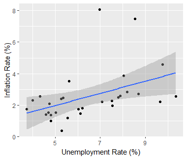

# Problem 1 

In the main lecture, we discussed the empirical estimation of the
output-inflation tradeoff by Ball. Since the paper was published over
30 years ago, it is interesting to see if the results have changed and if they did how.
To obtain the ”trade-off” parameter, estimate the following equation using OLS

$$y_{i,t} = c + \gamma_{i,t} + \tau_{i}\Delta x_{i,t} + \lambda_{i}y_{t-1}$$

where $y_{i,t}$ is log real GDP, $\gamma_{i,t}$ is a time trend, $\Delta x_{i,t}$ is the change in log nominal
GDP and $y_{t-1}$ is lagged log real GDP. i is the country indicator and t is the time indicator.
$\tau_{i}$ is the variable of interest for us.

```{r message=FALSE, echo=FALSE, warning=FALSE}
library(wbstats)
library(dplyr)
library(ggplot2)
library(knitr)
```


```{r echo=FALSE}
df <- wb_data(c("NY.GDP.MKTP.CD","NY.GDP.MKTP.KD", "FP.CPI.TOTL.ZG"), start_date = 1960, end_date = 2018, freq="Y")
df <- df[c('country','date','FP.CPI.TOTL.ZG','NY.GDP.MKTP.CD','NY.GDP.MKTP.KD')]
names(df) <- c('country','year','inflation','nominalGDP','realGDP')
df <- na.omit(df)

countries = names(head(sort(table(df$country), decreasing = TRUE), 41))
df = subset(df, country %in% countries)

df$lognominalGDP <- log(df$nominalGDP)
df$logrealGDP <- log(df$realGDP)

df_average <- df %>% group_by(country) %>% summarise("inflation-mean" = mean(inflation), 
                                       "inflation-std" = sd(inflation),
                                       "nominal-GDP-mean" = mean(nominalGDP), 
                                       "nominal-GDP-std" = sd(nominalGDP),
                                       "real-GDP-mean" = mean(realGDP),
                                       "real-GDP-std" = sd(realGDP),
                                       )
```

```{r echo=FALSE}
tau_values = c()

for(one_country in countries){
  country_data <- filter(df, country == one_country)
  country_data <- country_data %>% arrange(desc(country_data$year))
  
  change_log_nominalGDP <- diff(country_data$lognominalGDP)
  change_log_nominalGDP = append(change_log_nominalGDP, 0)
  
  country_data$change_log_nominalGDP = change_log_nominalGDP
  
  model <- lm(logrealGDP ~ change_log_nominalGDP +  lag(logrealGDP, 1), data = country_data)
  
  tau_values<- c(tau_values , coefficients(model)[2][["change_log_nominalGDP"]])
  }

df_tau = data.frame(unlist(countries),unlist(tau_values))
names(df_tau) = c("country","tau")
```

## 1.a)

Give the economic interpretation of $\tau$ . What does it mean if $\tau$ is low or high?
\

***

\

$\tau$ is the output-inflation trade-off which refers to the relationship between the level of economic output
(usually measured in GDP), and the rate of inflation. The trade-off is regarded as a metric
that is looked when considering macroeconomic policies, business cycles, long term growth, etc. When the output-inflation tradeoff is high, it means that a country is able to achieve higher levels of output without experiencing significant increases in inflation. When the output-inflation tradeoff is low, it means that a country experiences significant increases in inflation as it tries to achieve higher levels of output.

\newpage

## 1.b) 

Choose a subset of three countries and compare your results to those of Ball et
al. (1988). Did the parameter $\tau$ change under your period of study compared
to that by Ball et al. (1988)?
\

***

\

The 3 countries I chose were Austria, United Kingdom, and the United States.

| Country | Time-frame| Trade-off value|
| ------------- |:-------------:| -----:|
| Austria      | 1960-2019 | -0.0132|
| United Kingdom      | 1960-2019|   -0.0120|
| United States | 1960-2019|    -0.0636|

These are the values for the same country from the Bell (1988) paper.

| Country | Time-frame| Trade-off value|
| ------------- |:-------------:| -----:|
| Austria      | 1950-86 | -0.0196|
| United Kingdom      |1948-86|   -0.0199|
| United States | 1948-86|    0.6714|

Comparing Austria and the United Kingdom, the value of the trade-off parameter didn’t change much, but when comparing the US it changed drastically. It’s important to note that the trade-off values are not comparable across countries, and also, the trade-off values change over time can be affected by a complex interplay of various factors such as changes in expectations, productivity, monetary policy, and supply shocks.

## 1.c)

Equivalent to Ball et al. (1988) produce a scatterplot where $\tau$ is on the y-axis
and mean inflation is on the x-axis. How does your graph compare to the one
by Ball et al. (1988)?

\newpage

Figure 1. My scatter plot

```{r echo=FALSE, fig.align="center"}
knitr::include_graphics("img/trade-off-my-plot.png")
```

Figure 2. The paper scatter plot

```{r echo=FALSE, fig.align="center"}

```

\newpage

When comparing my plot with the plot from the paper, we see the distributions of the $\tau$ value are very similar. There are some outliers on the far right side, but most of it is focused around the 0. But, the ranges for the mean inflation are very different, which the reason could be that some countries have experienced hyperinflation since the period in the paper.

## 1.d)

What are potential explanations for any cross-country differences in $\tau$?
\

***

There are several potential explanations for cross-country differences in the output-inflation trade-off $\tau$ .  
\
Monetary policy: Different countries may have different monetary policies, which can affect the outputinflation trade-off. For example, a country with a more expansionary monetary policy may have a higher output-inflation trade-off than a country with a more contractionary monetary policy.  
\
Productivity: Countries with higher productivity levels may be able to achieve higher levels of output without experiencing significant increases in inflation, leading to a higher output-inflation trade-off.  
\
Supply shocks: Countries that are more exposed to supply shocks, such as changes in the price of oil, may have a lower output-inflation trade-off than countries that are less exposed to such shocks  
\
Of course, there are plenty of other factors as well that can explain the difference between countries in the trade off coefficient. These include differences in labor market institutions, inflation expectations, the degree of globalization, and demographic changes. These factors can also interact with each other, making it difficult to isolate the specific causes of cross-country differences in the output-inflation trade-off.

\newpage

# Problem 2

We want you to work on the Phillips curve by describing its theoretical
foundation and checking whether it has been stable in selected economies.

## 2.a)

Describe the Phillips curve and the relationship between its variables.
\

***

\


The Phillips curve is an economic concept that describes the relationship between the unemployment rate and the inflation rate. The basic idea behind the Phillips curve is that there is an inverse relationship between unemployment and inflation: when unemployment is low, inflation tends to be high, and when unemployment is high, inflation tends to be low. The Phillips curve is typically represented graphically, with the unemployment rate on the x-axis and the inflation rate on the y-axis. The curve slopes downward, indicating that as unemployment decreases, inflation increases. The relationship between unemployment and inflation described by the Phillips curve is not always stable. In the long-run, the Phillips curve can be vertical and this is known as the natural rate of unemployment, this means that unemployment and inflation are not related in the long-run. Additionally, the Phillips curve can shift due to factors such as changes in expectations, productivity and monetary policy.


## 2.b)

Plot the Phillips curves for Austria, France, the United Kingdom and the
United States from 1990 until today. Plot the inflation rate on the y-axis and
the unemployment rate on the x-axis.

```{r echo=FALSE}
df <- wb_data(c("NY.GDP.MKTP.CD","NY.GDP.MKTP.KD", "FP.CPI.TOTL.ZG", "SL.UEM.TOTL.NE.ZS"), start_date = 1990, end_date=2023, freq="Y")
df <- df[c('country','date','FP.CPI.TOTL.ZG','NY.GDP.MKTP.CD','NY.GDP.MKTP.KD', 'SL.UEM.TOTL.NE.ZS')]

names(df) <- c('country','year','inflation','nominalGDP','realGDP', 'unemployment')
df <- na.omit(df)

df_austria <- df[df$country == "Austria", ]
df_france <- df[df$country == "France", ]
df_uk <- df[df$country == "United Kingdom", ]
```

\newpage

Figure 3. Austria Phillips curve

```{r echo=FALSE, fig.align="center"}
knitr::include_graphics("img/austria-phillips-curve.png")
```

Figure 4. France Phillips curve

```{r echo=FALSE, fig.align="center"}

```

\newpage

Figure 5. United Kingdom Phillips curve

```{r echo=FALSE, fig.align="center"}

```

\newpage

## 2.c)

Check the stability of the Phillips curve through time. Plot the Phillips curve
for Austria and the United Kingdom from 1971 to 1986, from 1987 to 2002 and
from 2003 until today separately for each country in one graph.
Does the Phillips curve change or remain constant? If it changes, explain how.

Figure 6. Austria-UK Phillips curve (1971-1986)

```{r echo=FALSE, fig.align="center"}

```

\newpage

Figure 7. Austria-UK Phillips curve (1987-2002)

```{r echo=FALSE, fig.align="center"}

```

Figure 8. Austria-UK Phillips curve (2003-2023)

```{r echo=FALSE, fig.align="center"}

```

In the first period (1971-1986) we see that the phillips curve is trending down, which means that the inflation rate was decreasing while the unemplyoment rate was increasing. For Austria the trend is a bit slower, while for UK is faster. In the next 2 periods (1987-2002, 2003-2023), we see the same trend contiue for Austria. While UK from 1987 onwards, gets a slight increase in inflation, along with increase in unemployment rate.


## 2.d)

What are possible reasons for a change in the Phillips curve over time?
\

***

\

There are several reasons why the Phillips curve can change over time. Some of the most common reasons include:  
\
Expectations: Changes in inflation expectations can affect the relationship between unemployment and inflation. If people expect inflation to be higher or lower than it actually is, this can shift the Phillips curve.  
\
Productivity: Changes in productivity can affect the relationship between unemployment and inflation. If productivity improves, firms can produce more goods and services with the same number of workers, which can lead to lower unemployment and higher inflation, and cause the Phillips curve to shift.  
\
Supply shocks: Unanticipated changes in the supply of goods and services, such as natural disasters or changes in the price of oil, can cause the Phillips curve to shift. These events can disrupt the balance between unemployment and inflation, causing the curve to move in a different direction.  
\
There are many other factors as well, and the relationship between unemployment and inflation is affected by a complex interplay of various factors and can change over time.
